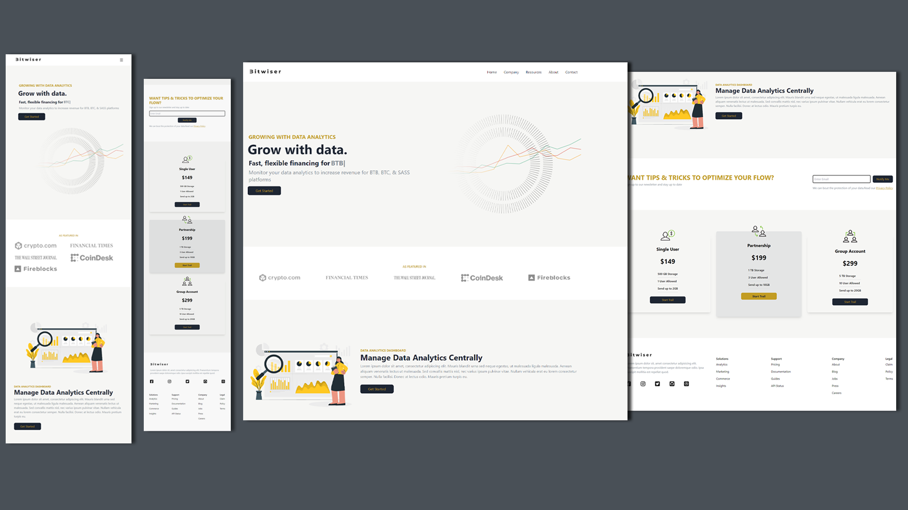

# Bitwiser Data Financial Website

Bitwiser is a personal project where I explore the possibilities of using React and Tailwind to create a static website. With Tailwind and React I was able to build a responsive and comfortable to use website that users can easily navigate.

## Visual Overview



## Built With

- [React](https://reactjs.org/) - JavaScript library for building user interfaces.
- [Tailwind CSS](https://tailwindcss.com/) - low-level CSS framework.
- [React Icons](https://react-icons.github.io/react-icons/) - Collection of icons for React applications.
- [React Typed](https://www.npmjs.com/package/react-typed) - Animated typing effects in React applications.

## Installation

Follow these steps to set up the project on your local machine:

1. Clone the repository:

   ```shell
   git clone https://github.com/khalid-nur/bitwiser-finance-static-website.git

   ```

2. Navigate to the project directory:

   ```shell
   cd bitwiser-finance-static-website

   ```

3. Install the required dependencies:

   ```shell
   npm install
   ```

## Usage

Feel free to use this project as a starting point for your own website or as a reference for learning React, Tailwind, and other related. To start the development server and view the website, run the following command:

```shell
npm start
```

## Author

### Khalid Nur

- GitHub: [khalid-nur](https://github.com/khalid-nur)
- LinkedIn: [khalidnur](https://www.linkedin.com/in/khalidnur/)

## Contribute

Show your support by ⭐ the project.
